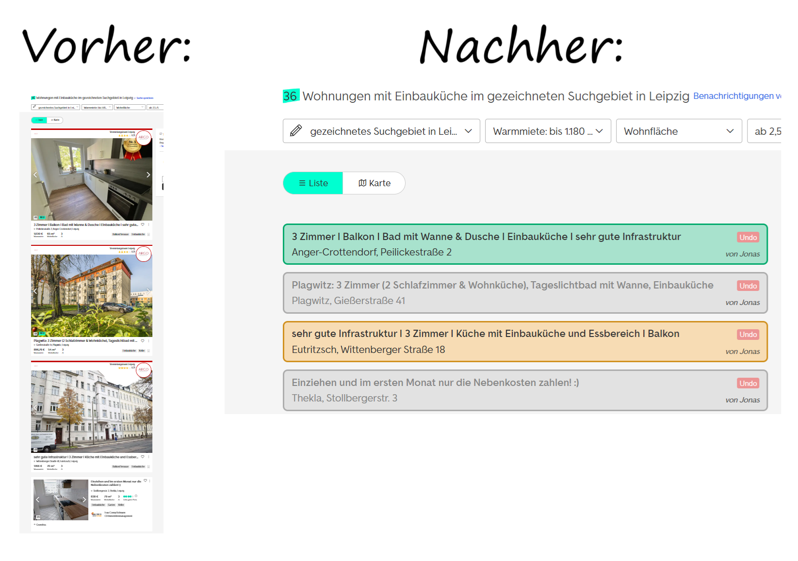

# Immo-Helper

Immo-Helper ist ein Tool, was mich bei meiner Suche nach Wohnungen auf https://www.immobilienscout24.de/ unterstützt.

## Vorteile

- Wohnungen als "interessant", "vielleicht" und "uninteressant" hinzufügen
- übersichtliche Darstellung der Suchergebnisse
- gemeinsam mit Freunden/Partnern an einer Wohnungssuche arbeiten
- [geplant] Frontend-Darstellung für alle hinzugefügten Wohnungen




## Installation

### Backend

```bash 
git clone https://github.com/LeTammo/immohelper.git
cd immohelper/backend
npm install
npm start
```

Browser-Script:

1. Die Browser-Erweiterung [Tampermonkey](https://www.tampermonkey.net/) installieren.
2. `browser-script.js` in Tampermonkey einfügen.
3. Die Konstante `username` im Script anpassen
4. 5ggf. '@connect' in der Tampermonkey-Script-Header anpassen.
5. Script speichern/aktivieren.